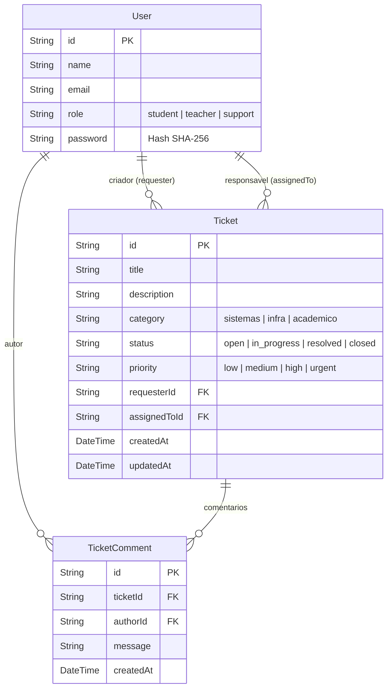

# Sumário Geral do Sistema - Oxetech Helpdesk

Este documento fornece uma visão geral completa da arquitetura, tecnologias, modelos de dados e fluxos de trabalho do projeto **Oxetech Helpdesk**. Ele serve como um guia de onboarding para que qualquer desenvolvedor ou assistente de IA possa entender a base de código e continuar o desenvolvimento de forma consistente.

---

## 1. Visão Geral do Sistema
O **Oxetech Helpdesk** é um sistema monorepo para gerenciamento de chamados de suporte técnico (helpdesk). Ele permite que usuários com diferentes papéis (Estudantes, Professores e Suporte) abram chamados, adicionem comentários, alterem prioridades e gerenciem o fluxo de resolução de problemas de TI.

---

## 2. Estrutura de Arquivos (Monorepo)
O projeto está organizado como um monorepo contendo duas sub-aplicações totalmente isoladas:

```
├── backend/                  # Servidor API Express, Prisma ORM e Testes
│   ├── prisma/               # Schema do banco, migrations e seed script
│   ├── src/
│   │   ├── controllers/      # Controladores da API Express (Handlers de Rota)
│   │   ├── domain/
│   │   │   ├── errors/       # Exceções personalizadas de domínio
│   │   │   ├── services/     # Camada de Serviços (Regras de Negócio)
│   │   │   └── utils/        # Mappers, formatadores e password utility
│   │   ├── infrastructure/   # Camada de Persistência (Prisma Repository)
│   │   ├── middleware/       # Middleware de tratamento de erro global
│   │   ├── app.ts            # Inicialização e configuração do Express
│   │   └── server.ts         # Ponto de entrada física (escuta da porta)
│   ├── Dockerfile
│   └── package.json
│
├── frontend/                 # SPA Client React + Vite
│   ├── src/                  # Componentes, estilos e páginas React
│   ├── Dockerfile
│   └── package.json
│
├── docs/                     # Documentação de arquitetura e guias
└── docker-compose.yml        # Orquestrador local (postgres, back, front, mailpit)
```

---

## 3. Stack Tecnológica

### Backend (API REST)
* **Runtime:** Node.js v20 (ambiente de execução principal)
* **Linguagem:** TypeScript (tipagem estática forte)
* **Framework Web:** Express (gerenciador de rotas HTTP)
* **ORM (Persistência):** Prisma Client (mapeamento do banco PostgreSQL)
* **Banco de Dados Relacional:** PostgreSQL (banco de dados em container)
* **Suíte de Testes:** Vitest + Supertest + Vitest Coverage v8
* **Ferramenta de Autenticação / Segurança:** Criptografia SHA-256 nativa (`crypto`)

### Frontend (SPA)
* **Framework:** React 18+ (biblioteca de visualização)
* **Build Tool:** Vite (compilador rápido e hot-reload)
* **Estilização:** Vanilla CSS (sem utilitários adicionais, com padrões premium escuros/glassmorphism)

### Infraestrutura Local
* **Docker / Docker Compose:** Orquestração de containers isolados para o Postgres, Mailpit (servidor de e-mails fake), Frontend e Backend.

---

## 4. Modelo de Dados e Relacionamentos (Prisma Schema)

O banco de dados PostgreSQL estruturado via Prisma é baseado em três modelos principais:



---

## 5. Padrões de Arquitetura de Software

O backend segue os princípios de separação de responsabilidades (SoC) com as seguintes camadas:

1. **Camada de Rotas (`backend/src/routes.ts`):** Apenas declara os endpoints HTTP e aponta para os controladores.
2. **Controladores (`backend/src/controllers/`):** Recebem as requisições HTTP, extraem os parâmetros, chamam a camada de serviços e enviam a resposta sanitizada.
3. **Serviços (`backend/src/domain/services/`):** Contêm **todas as regras de negócio**. Validam entradas, verificam regras (ex: só o suporte/autor altera status, chamados fechados exigem comentários) e disparam erros de domínio apropriados.
4. **Repositório (`backend/src/infrastructure/database/`):** Abstrai as transações do Prisma Client.
5. **Mappers (`backend/src/domain/utils/`):** Higienizam as informações confidenciais (ex: `sanitizeUser` remove o campo `password`) antes que os dados saiam do controlador na resposta HTTP.

---

## 6. Arquitetura de Tratamento de Erros
O sistema não utiliza blocos `try/catch` genéricos nos controladores.
* Quando uma regra de negócio falha na camada de serviço, dispara-se uma exceção de domínio personalizada (`NotFoundError` ou `ValidationError`).
* O Express 5 captura promessas rejeitadas automaticamente e as encaminha para o `error.middleware.ts`.
* O middleware intercepta o erro, verifica a instância do erro de domínio e envia uma resposta JSON padronizada com o código HTTP adequado (404 para Not Found, 400 para Validation Error, 500 para Erros Genéricos do Sistema).

---

## 7. Estratégia de Segurança de Credenciais
* **Hashes no Banco:** As senhas dos usuários nunca são salvas em texto puro. Elas são salvas usando criptografia SHA-256 no script de semente (`seed.ts`) e na criação de usuários.
* **Segurança do Repositório (Zero Secrets Leak):** As senhas padrão no script de semente do banco são lidas de variáveis de ambiente (`process.env.SEED_PASSWORD_ANA`, etc.). Se não informadas na VPS, caem em fallbacks de desenvolvimento longos e não detectáveis por scanners de segurança (`dev-ana-local-pass-123`).
* **Sanitização ativa:** Todo objeto `User` retornado pelas rotas da API passa pelo mapper de sanitização, excluindo o campo de senha da resposta em JSON.

---

## 8. Suite de Testes e Cobertura
* **Testes de Integração:** Validam todas as rotas e respostas HTTP de ponta a ponta usando `supertest` no banco de dados.
* **Testes Unitários:** Validam os mapeadores e o `TicketService` de forma isolada, mockando a conexão do banco com utilitários integrados do Vitest.
* **Metas de Qualidade:** O projeto está configurado para travar o build se a cobertura de testes da API cair abaixo de **80%** (a cobertura atual é de **97.87%**).

---

## 9. Comandos Básicos do Ciclo de Desenvolvimento

Para rodar o ambiente completo localmente:

```bash
# 1. Iniciar containers
docker compose up -d --build

# 2. Aplicar migrações do Prisma no container do backend
docker compose exec back npx prisma migrate deploy

# 3. Popular o banco com dados iniciais (seed)
docker compose exec back npm run seed

# 4. Rodar a suite de testes locais (fora do docker ou no backend/)
cd backend
npm run typecheck      # Verifica os tipos TypeScript
npm test               # Roda os testes
npx vitest run --coverage  # Roda a cobertura de testes
```
